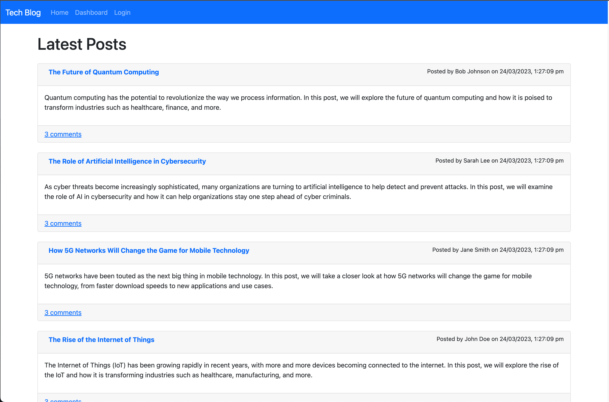
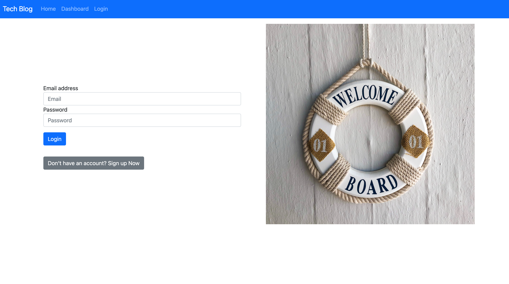
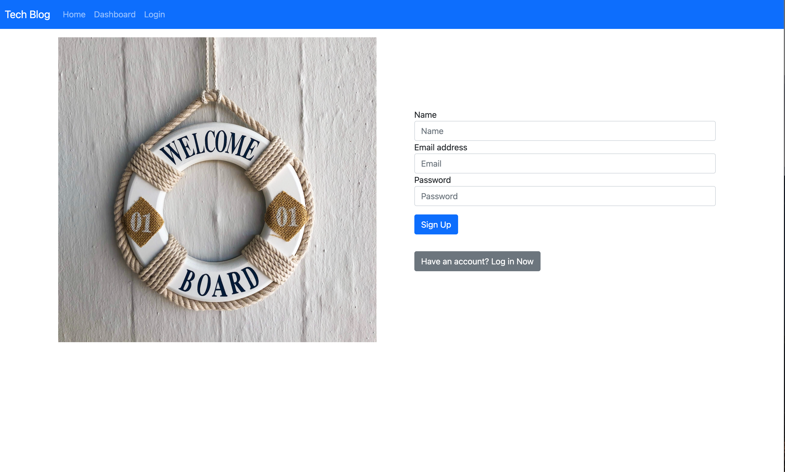
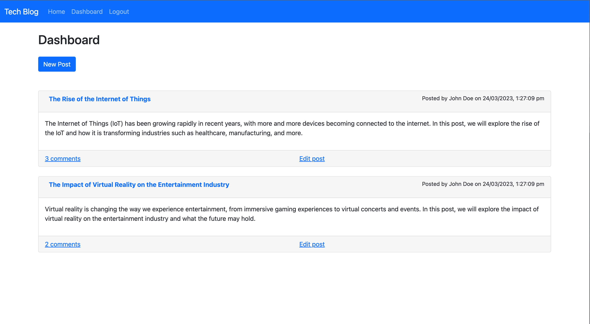
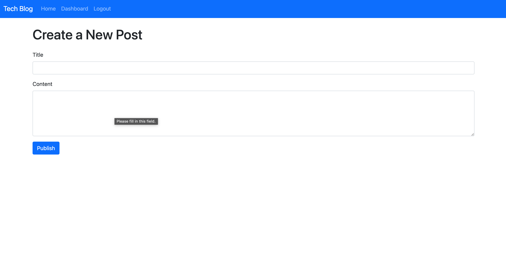
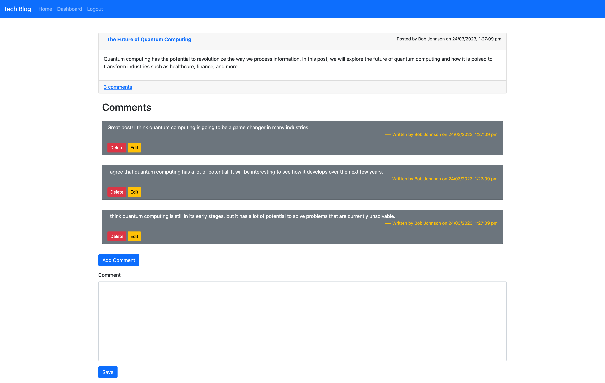
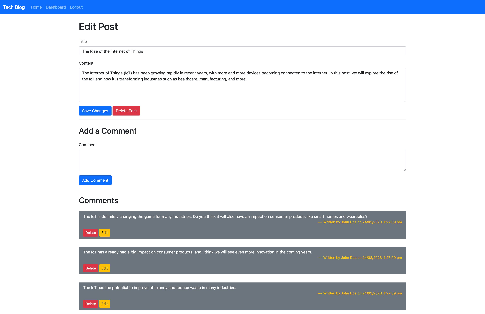

# Tech-Blog
Model-View-Controller (MVC)


## Description

The Tech Blog Project is a full-stack web application designed to provide users with a platform to share their thoughts and experiences related to the ever-evolving field of technology. This project aims to create a user-friendly and interactive environment where users can create, edit, and delete posts while engaging with others through comments.

During the development of this project, I encountered numerous challenges that tested my skills and understanding of web development concepts. These problems ranged from rendering content dynamically to implementing user authentication and managing comments. Through perseverance and a systematic approach, I managed to overcome these obstacles, ultimately resulting in a functional and visually appealing Tech Blog.

One of the most significant problems I faced was dynamically rendering the number of comments associated with a particular post. This issue persisted in multiple views, such as the dashboard and the edit post pages. To resolve this, I leveraged the power of Handlebars.js, a templating engine, to create custom helpers and partials that efficiently displayed the desired information. By learning how to utilize Handlebars.js effectively, I was able to enhance the project's overall functionality and user experience.

Another challenge I encountered was implementing a delete feature for user-generated comments. This feature required the proper identification and association of user IDs with their corresponding comments. Through the creation of custom Handlebars helpers and careful consideration of the data flow, I ensured that the delete button was only visible to the user who created the comment. This addition greatly improved the user's ability to manage their content, contributing to the overall user experience.

User authentication was also a crucial aspect of this project, ensuring that only authorized users had access to specific features and content. By using express-session and middleware functions, I was able to create a secure and robust authentication system that protected user data and maintained the integrity of the platform.

Throughout this project, I learned a great deal about full-stack web development, including working with databases, routing, and front-end frameworks. I gained valuable experience in organizing code, debugging, and finding creative solutions to the challenges I faced. This project also helped me deepen my understanding of user experience and the importance of creating a responsive and intuitive interface.

In conclusion, the Tech Blog Project served as an incredible learning experience, pushing me to expand my skills and knowledge in full-stack web development. By solving various problems and continuously refining the application, I not only created a functional and user-friendly platform but also grew as a developer. With each challenge overcome, the Tech Blog Project became a testament to my dedication, resilience, and passion for web development.

## Table of Content

* [Installation](#installation)
* [Usage](#usage)
* [Contribution](#contribution)
* [License](#license)
  
## Made With


  
## Installation  

```
npm install
```

## Usage

To view this application,the following image shows the landing page of the application, or click on the page link that demonstrates the functionality of this project:\
<https://infinite-depths-74692.herokuapp.com/>

Homepage:

Login page:

Sign-up page:

Dashboard page:

Create new post page:

Single post page:

Edit post page:



## License


Link to license: <https://opensource.org/licenses/MIT>

```
Copyright (C) 2023 Gary GAO

Permission is hereby granted, free of charge, to any person obtaining a copy of this software and associated documentation files (the "Software"), to deal in the Software without restriction, including without limitation the rights to use, copy, modify, merge, publish, distribute, sublicense, and/or sell copies of the Software, and to permit persons to whom the Software is furnished to do so, subject to the following conditions:

The above copyright notice and this permission notice shall be included in all copies or substantial portions of the Software.

THE SOFTWARE IS PROVIDED "AS IS", WITHOUT WARRANTY OF ANY KIND, EXPRESS OR IMPLIED, INCLUDING BUT NOT LIMITED TO THE WARRANTIES OF MERCHANTABILITY, FITNESS FOR A PARTICULAR PURPOSE AND NONINFRINGEMENT. IN NO EVENT SHALL THE AUTHORS OR COPYRIGHT HOLDERS BE LIABLE FOR ANY CLAIM, DAMAGES OR OTHER LIABILITY, WHETHER IN AN ACTION OF CONTRACT, TORT OR OTHERWISE, ARISING FROM, OUT OF OR IN CONNECTION WITH THE SOFTWARE OR THE USE OR OTHER DEALINGS IN THE SOFTWARE.
  
```
  
## Contribution

Thanks for the start code provided by the web bootcamp.

## Tests

```
N/A
```

## Questions

N/A

## Contact

* For any question about this project, please email me at: gary.yanggao@gmail.com
* To see more of my projects, follow me on Github at: <http://github.com/Mid30s>
  
[](mailto:gary.yanggao@gmail.com)
[](https://github.com/Mid30s)
